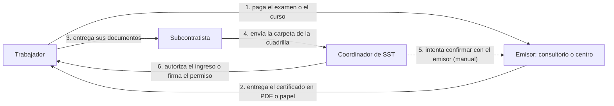

# Problem Brief

## Decisión

- **Problema elegido y quién lo propuso:** HabilitApp: un sistema para que las entidades emisoras pequeñas entreguen certificados verificables (concepto médico ocupacional, trabajo en alturas, espacios confinados y operador de grúa) y para que el coordinador de seguridad y salud en el trabajo de la obra los consulte y confirme que son auténticos y están vigentes. Propuesto por **Diego Vallejos**.

- **Justificación de la selección (criterios de la Sesión 1):**
  - Vemos una oportunidad en las entidades pequeñas (consultorios de salud ocupacional y centros de entrenamiento) que no tienen ni la confianza ni la tecnología para que se validen los certificados que emiten. Las otras propuestas abordaban entidades públicas o privadas grandes.
  - Cumple los criterios de la Sesión 1: varios emisores que no confían entre sí, incentivo para falsificar o alterar documentos, un tercero que verifica sin llamar al emisor y revocación visible de un centro completo.
  - Los datos públicos respaldan el problema: 534.444 accidentes laborales en 2025, 61 muertes en construcción y certificados falsos de alturas circulando a nombre del Ministerio del Trabajo.
  - Es fácil de validar con coordinadores de seguridad y salud en el trabajo en Medellín, y el riesgo legal es bajo porque en la cadena solo van hashes.

- **Propuestas rechazadas y razones:**
  1. **Título con doble firma** (**Andres Aguirre**). Cumple 4 de 5 condiciones, pero involucra a entidades grandes, el ICFES y las universidades, de cuya adopción depende. Tiene competencia parcial (credenciales de una sola firma y el código de verificación del ICFES), es políticamente sensible y "una API entre el ICFES y el SNIES bastaría" es un contraargumento razonable.
  2. **Incapacidades verificables** (**Luis Patino**). Cumple 3 de 5 condiciones y es la más débil en "por qué blockchain". Involucra a EPS e IPS, puede que las EPS ya tengan portales de verificación, y saber que alguien estuvo incapacitado es un dato sensible (Ley 1581 de 2012).

- **Metodología de decisión:** cada integrante propuso una idea. El equipo las comparó con 6 criterios: datos públicos, facilidad de validar con usuarios, cuántas de las 5 condiciones de "¿por qué blockchain?" cumple, competencia, complejidad del MVP y riesgo legal. Esas 5 condiciones cubren los tres criterios de la Sesión 1: registro compartido entre partes que desconfían, historial inmutable y eliminación de intermediarios. La decisión final se tomó por el tipo de emisor al que sirve cada propuesta.

---

> Cada sección a continuación debe tener entre 150 y 300 palabras.

## 1. Encabezado

**Nombre del proyecto:** HabilitApp

**Descripción del problema:** En las obras de construcción, la seguridad de quien hace tareas de alto riesgo (trabajo en alturas, espacios confinados, operación de grúa) depende de dos papeles: el concepto médico ocupacional y los certificados de capacitación. Esos documentos los emiten consultorios de salud ocupacional y centros de entrenamiento pequeños, que no tienen ni la tecnología ni la confianza para demostrar que sus certificados son reales: un PDF auténtico no se distingue de uno falso. Del otro lado, el coordinador de seguridad y salud en el trabajo de la obra debe revisar que los papeles de cada trabajador estén al día, y no tiene cómo comprobar que sean auténticos, que estén vigentes ni que los haya emitido una entidad autorizada. Así, personas no aptas o no capacitadas pueden terminar haciendo tareas de alto riesgo. A esto se suma un riesgo legal: si ocurre un accidente y un trabajador no tiene su certificado al día, el empleador o contratante puede ser considerado responsable.

**Solución propuesta:** HabilitApp les da a las entidades emisoras pequeñas una forma rápida, fácil y confiable de entregar sus certificados y de que puedan verificarse. Cada certificado queda firmado por quien lo emite y registrado en blockchain, y se entrega con un QR para verificarlo. Los coordinadores en obra son usuarios de la solución cuando consultan un certificado: escanean el QR y ven si es auténtico, si está vigente y si lo emitió una entidad autorizada. Empezamos en construcción, con la posibilidad de ampliarlo a otros sectores y usuarios.

## 2. Equipo y roles

| Integrante | Rol | Usuario de GitHub |
|---|---|---|
| Diego Vallejos | TBD | dfvallejosc |
| Andres Aguirre | TBD | andres9602 |
| Luis Patino | TBD | patinoaluise |

## 3. Planteamiento del problema

**Contexto.** La construcción es de los sectores más riesgosos del país: en 2025 hubo 534.444 accidentes de trabajo en Colombia (unos 1.464 por día) y 61 muertes en construcción, el 13,9% del total (Consejo Colombiano de Seguridad). Las tareas de alto riesgo (trabajo en alturas, espacios confinados, operación de grúa) exigen que el trabajador tenga un concepto médico ocupacional y los certificados de capacitación o competencia vigentes. Esos documentos los emiten consultorios de salud ocupacional y centros de entrenamiento pequeños, y llegan a la obra como PDF o papel.

**Frecuencia.** Se repite cada vez que un trabajador ingresa a la obra o se firma un permiso de tarea de alto riesgo, y con subcontratistas cada cuadrilla trae documentos de emisores distintos.

**Alcance.** Afecta a las constructoras que contratan con subcontratistas, cuyas cuadrillas traen documentos de decenas de emisores distintos, y a los consultorios y centros pequeños, cuyos certificados legítimos no se distinguen de los falsos.

**Evidencia.** En alturas hay certificados falsos en circulación: en diciembre de 2022 el Ministerio del Trabajo advirtió que se venden certificados a su nombre, cuando el Ministerio no imparte formación ni emite estos certificados. Se han reportado cobros de entre $350.000 y $800.000 (El País). Para quien revisa, un documento así no se distingue a simple vista de uno real. Para el concepto médico, los espacios confinados y la operación de grúa no encontramos cifras públicas.

## 4. Usuarios y actores

**Usuario principal: entidad emisora pequeña.** Son consultorios de salud ocupacional y centros de entrenamiento (alturas, espacios confinados, operación de grúa) con pocos médicos o instructores. Emiten los certificados que exigen las obras, pero no tienen la tecnología ni la confianza para demostrar que son auténticos: sus documentos circulan como PDF o papel, y uno real no se distingue de uno falso. Necesitan una forma rápida, fácil y confiable de entregarlos y respaldarlos.

**Usuario secundario: coordinador de seguridad y salud en el trabajo.** Trabaja en la constructora o para ella, y revisa que los papeles de cada trabajador estén al día antes de que ingrese a la obra o de firmar el permiso de una tarea de alto riesgo. Recibe documentos de muchos emisores distintos, no tiene cómo comprobarlos y responde por lo que pase en la obra. Usa HabilitApp cuando consulta un certificado.

**Otros actores en el flujo de valor:**
- **Trabajador:** recibe sus certificados del emisor, con un QR para verificarlos, y los presenta en la obra.
- **Subcontratista:** contrata a la cuadrilla y envía sus documentos a la constructora.
- **Constructora (empleador o contratante):** dirige la obra y puede ser considerada responsable si ocurre un accidente sin el certificado al día.
- **Ministerio del Trabajo:** publica la lista de centros de entrenamiento autorizados.
- **HabilitApp:** registra a los emisores autorizados, mantiene el registro de certificados y revoca a quien corresponda.

## 5. Flujo de valor actual

Hoy el flujo es manual y los certificados pasan por varias manos antes de llegar a quien los revisa.

1. Se paga el examen médico o el curso al consultorio o centro emisor. Es el único movimiento de dinero del flujo.
2. El emisor le entrega al trabajador el concepto o certificado como PDF o papel.
3. El trabajador se lo entrega a su subcontratista, que lo suma a la carpeta de la cuadrilla.
4. El subcontratista envía la carpeta al coordinador de seguridad y salud en el trabajo de la constructora.
5. El coordinador revisa a mano las fechas y vigencias y, cuando puede, intenta confirmar con el emisor por teléfono o en su página, si la tiene. Este paso es opcional y no siempre es posible.
6. El coordinador autoriza el ingreso o firma el permiso de la tarea de alto riesgo.

Lo que viaja es información: el certificado, siempre como una copia que pasa de mano en mano. En ningún punto se puede comprobar que el documento no se haya falsificado o alterado en el camino.

## 6. Puntos de fricción

En el flujo actual identificamos cinco fricciones. Las cuatro primeras se sienten en la revisión de certificados en la obra; la última, del lado de quien los emite.

| # | Fricción | Causa | Afecta a |
|---|---|---|---|
| F1 | El documento se puede falsificar o alterar sin que se note | Circula como PDF o papel, sin una firma que se pueda comprobar | Coordinador, constructora y trabajador |
| F2 | No se sabe si el emisor está autorizado | No hay un registro único de emisores confiables, y la lista oficial solo cubre centros de entrenamiento | Coordinador |
| F3 | Confirmar un certificado es manual y no siempre posible | Depende de llamar al emisor o de que tenga página propia | Coordinador |
| F4 | Los vencimientos pasan inadvertidos | El control de fechas se lleva a mano | Coordinador y trabajador |
| F5 | El emisor pequeño no puede demostrar que sus certificados son reales | Su documento se ve igual al falso | Emisor |

## 7. Oportunidad prioritaria e hipótesis blockchain

**Fricción prioritaria: F1.** El documento se puede falsificar o alterar sin que se note. Es la que HabilitApp ataca de frente, y al resolverla se atienden las demás: si solo vale lo que firma un emisor registrado, se sabe quién lo emitió (F2), se puede comprobar sin llamarlo (F3), la vigencia queda visible (F4) y el emisor pequeño puede demostrar que sus certificados son reales (F5).

**Oportunidad.** Darles a los emisores pequeños un registro compartido donde cada certificado queda firmado por quien lo emitió, y a los coordinadores una consulta inmediata. El registro es curado: HabilitApp solo acepta emisores que cumplan condiciones de autorización y puede revocar a quien deje de cumplirlas. Eso hace que el líder de obra confíe en los certificados que le llevan sus trabajadores.

**Hipótesis blockchain.** Creemos que si cada emisor firma sus certificados y su huella queda registrada en blockchain, entonces el coordinador podrá comprobar en segundos, escaneando un QR, que un certificado no fue alterado, está vigente y viene de un emisor autorizado. Consultar el registro no requiere esperar la confirmación de la red, así que la verificación puede ser inmediata. Nuestra meta para el MVP es que tome menos de 10 segundos. Y el emisor pequeño podrá demostrar que sus certificados son reales.

## 8. Criterio de pertinencia

Una base de datos común no resuelve este problema, y un registro distribuido sí. Cumple los tres criterios de la Sesión 1:

1. **Registro compartido entre partes que no confían entre sí.** Los emisores son consultorios y centros independientes, y ninguno aceptaría que otro fuera dueño del registro donde están sus certificados. El coordinador tampoco tendría por qué confiar en ese dueño.
2. **Historial inmutable.** Hay motivos para cambiar una fecha de vigencia o fabricar un certificado con fecha anterior, por ejemplo después de un accidente. En un registro distribuido cualquier cambio queda visible.
3. **Sin un intermediario que concentre la confianza.** Una base de datos de la constructora solo sirve en sus obras, y el trabajador empieza de cero en la siguiente. Una plataforma central tiene un dueño en quien todos tendrían que confiar. Con un registro compartido, ninguna parte controla los datos y las reglas son iguales para todos.

Además, hay dos ventajas prácticas:
- **Verificación sin depender del emisor.** El coordinador escanea el QR y comprueba el certificado aunque el centro haya cerrado, no tenga página o no conteste el teléfono.
- **Revocación visible al instante.** Si se saca a un emisor del registro, todos sus certificados cambian de estado en todas las obras a la vez.

## 9. Supuestos y riesgos

**Supuestos**
- Los emisores pequeños aceptarían usar HabilitApp, sobre todo si las constructoras empiezan a exigirla.
- Los coordinadores revisan hoy estos certificados a mano y han visto documentos dudosos.
- Las constructoras exigirían la verificación de los certificados a sus subcontratistas.
- El empleador no revisa porque no puede comprobar los documentos, no porque no quiera.
- Hay internet en la obra, o se puede verificar con datos descargados.

**Riesgos**
- **El emisor puede mentir desde el origen.** La blockchain garantiza que el certificado no fue alterado y quién lo firmó, pero no que el emisor diga la verdad. Se mitiga con el registro curado de emisores y la revocación, pero no se elimina.
- **Mercado de dos lados.** Sin emisores no hay qué verificar, y sin constructoras que exijan la verificación, los emisores no tienen razón para sumarse.
- **Informalidad.** Las cuadrillas sin ninguna vinculación formal no entran solas. Según Camacol, la informalidad dentro de las obras llega al 71% (95% en microempresas). El usuario inicial es la constructora formal.
- **Datos sensibles.** El concepto médico es información de salud. En la cadena solo van huellas digitales, no los datos.
- **Competencia.** Ya existe software para constructoras, como Verifty, que valida los certificados de los contratistas contra el registro de quien los emitió y bloquea el ingreso de quien no los tiene al día. HabilitApp se enfoca en los emisores pequeños.
