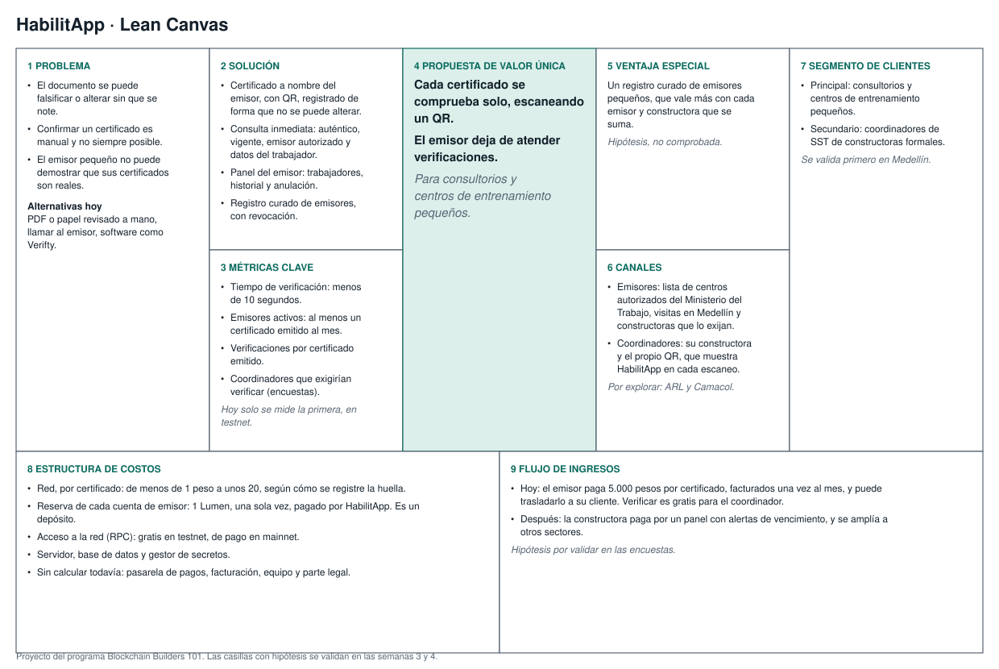
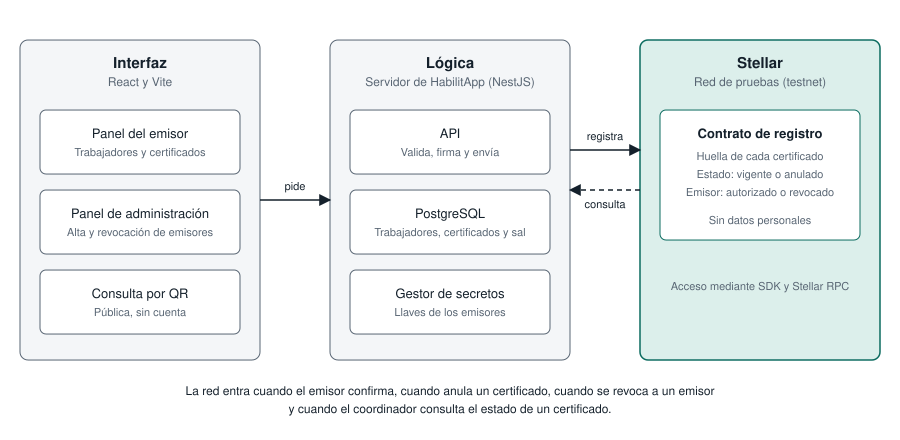

# Product Blueprint

**Nombre del proyecto:** HabilitApp

**Repositorio (enlace obligatorio):** [blockchain-builders-101](https://github.com/dfvallejosc/blockchain-builders-101)

---

## Contenido

1. Priorización de historias
2. Propuesta de valor
3. Flujo de usuario
4. Alcance del MVP
5. Lean Canvas
6. Backlog priorizado (Kanban)
7. Arquitectura inicial
8. Uso de Stellar y justificación

---

## 1. Priorización de historias

**Criterio de priorización:** método MoSCoW simplificado (imprescindible / debería / podría). Dentro de cada nivel, las historias van ordenadas por su aporte al recorrido principal del producto y a la propuesta de valor. Las 20 historias del equipo pasan al backlog.

| Prioridad | Historia | Propuesta por | Por qué entra al backlog |
| :---: | --- | :---: | --- |
| 1 | Como emisor, quiero emitir un certificado con un código QR a partir de los datos del trabajador, para que se compruebe solo, sin tener que atender llamadas de confirmación. | Equipo | Imprescindible. Es lo que la propuesta de valor le promete al emisor. |
| 2 | Como coordinador de SST, quiero ver, al escanear el QR, si el certificado es auténtico, para no autorizar a nadie con un documento falso o alterado. | Equipo | Imprescindible. Ataca la falsificación, la fricción prioritaria del Problem Brief. |
| 3 | Como coordinador de SST, quiero ver el nombre y el documento del trabajador al escanear el QR, para confirmar que el certificado corresponde a quien tengo enfrente. | Equipo | Imprescindible. Sin esto un trabajador podría presentar el QR de otra persona. |
| 4 | Como coordinador de SST, quiero ver la fecha hasta la que el certificado está vigente, para no dejar entrar a un trabajador con papeles vencidos. | Equipo | Imprescindible. Cubre los vencimientos que hoy pasan inadvertidos. |
| 5 | Como coordinador de SST, quiero ver si la entidad que emitió el certificado está autorizada, para estar seguro de que lo emitió alguien en quien puedo confiar. | Equipo | Imprescindible. Sin esto el coordinador no sabe quién respalda el documento. |
| 6 | Como emisor, quiero registrar a un trabajador con su nombre y número de documento, para emitirle certificados sin volver a escribir sus datos cada vez. | Equipo | Imprescindible. El paso 3 del flujo lo exige y requiere la autorización del trabajador para tratar sus datos. |
| 7 | Como emisor, quiero revisar los datos del certificado antes de confirmar su emisión, para no tener que anularlo por un error de digitación. | Equipo | Imprescindible. Es el paso 5 del flujo y evita trabajo posterior. |
| 8 | Como emisor, quiero entrar a HabilitApp con la cuenta de mi entidad, para emitir certificados a nombre de mi centro y que nadie más pueda hacerlo por mí. | Equipo | Imprescindible. Sin cuenta propia no se sabe quién emitió cada certificado. |
| 9 | Como administrador de HabilitApp, quiero registrar a una entidad emisora que cumpla las condiciones, para que solo emisores autorizados puedan emitir certificados. | Equipo | Imprescindible. Sin emisores autorizados no hay qué verificar. Puede hacerse con un script si el tiempo aprieta. |
| 10 | Como administrador de HabilitApp, quiero entrar con mi cuenta de administrador, para gestionar emisores sin que nadie más pueda hacerlo. | Equipo | Imprescindible. Sin sesión no se puede cumplir que solo el administrador registre emisores. Se recorta junto con el panel de administración. |
| 11 | Como emisor, quiero ver el historial de los certificados que he emitido con su estado, para saber cuáles siguen vigentes, cuáles vencieron y cuáles anulé. | Equipo | Debería. Es la base del panel del emisor y un requisito para anular. |
| 12 | Como emisor, quiero anular un certificado que emití con datos erróneos, para que nadie lo use por error. | Equipo | Debería. Responde a un error probable en la vida real. |
| 13 | Como coordinador de SST, quiero ver el motivo por el que un certificado no es válido (vencido, anulado o de un emisor revocado), para saber qué pedirle al trabajador. | Equipo | Debería. Cubre los casos de fallo que quedan fuera del recorrido principal. |
| 14 | Como administrador de HabilitApp, quiero revocar a un emisor del registro, para que sus certificados dejen de verse como válidos en todas las obras a la vez. | Equipo | Debería. Es una ventaja que destaca el Problem Brief y, con el panel hecho, es un botón más. |
| 15 | Como administrador de HabilitApp, quiero ver la lista de emisores registrados con su estado, para saber cuáles están activos y cuáles fueron revocados. | Equipo | Debería. Es la base del panel de administración. |
| 16 | Como administrador de HabilitApp, quiero ver cuántos certificados emitió cada entidad por mes, para facturarle y saber cuáles están activas. | Equipo | Debería. Se factura por certificado cada mes y esto sirve para contarlos. Muestra conteos, no datos de los trabajadores. |
| 17 | Como emisor, quiero ver la lista de los trabajadores que he registrado, para encontrar rápido a quien voy a emitirle un certificado. | Equipo | Debería. Es comodidad al volver a emitir. |
| 18 | Como emisor, quiero ver los certificados de un trabajador registrado, para saber cuáles tiene vigentes y cuáles debo renovarle. | Equipo | Debería. Ayuda a ofrecer la renovación antes de que venza. |
| 19 | Como trabajador de una cuadrilla, quiero ver todos mis certificados en un solo lugar, para presentarlos en la obra sin pedir copias a cada emisor. | Equipo | Debería. Resuelve el volumen de escaneos. Es la primera que entra si sobra tiempo. |
| 20 | Como trabajador, quiero recibir mi certificado por mensaje o correo apenas el emisor lo emite, para llevarlo a la obra sin volver al consultorio. | Equipo | Podría. Es deseable, pero el MVP funciona sin esto. |

---

## 2. Propuesta de valor

Para **consultorios de salud ocupacional y centros de entrenamiento pequeños** que pierden tiempo confirmando por teléfono sus propios certificados, HabilitApp es **un registro de certificados verificables** que logra que **cada certificado se compruebe solo, escaneando un QR, sin que el emisor tenga que atender ni montar nada**, a diferencia de **llamar uno por uno o armar un sistema propio de consulta por número**.

**Usuario (del Problem Brief):** el principal es la entidad emisora pequeña, que entrega los certificados que exigen las obras. El secundario es el coordinador de seguridad y salud en el trabajo, que los revisa antes de autorizar el ingreso.

**Resultado que obtiene:** el emisor deja de atender llamadas de confirmación. Como consecuencia, sus clientes confían más en él. El coordinador sabe en menos de 10 segundos si el certificado es auténtico, está vigente y viene de una entidad autorizada.

**Por qué elegiría esta solución:** porque no tiene que montar ni mantener un sistema propio. Emite y el resto lo resuelve HabilitApp. Además, las constructoras pueden pedir el registro en la plataforma, lo que les ahorra trabajo de verificación.

**En qué se diferencia de cómo lo resuelve hoy:** hoy el certificado circula como PDF o papel, y confirmarlo depende de llamar al emisor o de que tenga página propia. Con HabilitApp la confirmación no depende del emisor y funciona aunque el centro no conteste o haya cerrado.

---

## 3. Flujo de usuario

**Entrada:** un consultorio o centro de entrenamiento pequeño quiere usar HabilitApp y un trabajador acaba de aprobar su examen o curso. El emisor sabe usar un computador o un celular.

| Paso | Rol | Qué hace | Punto de interacción |
| :---: | :---: | --- | --- |
| 1 | Administrador | Registra a la entidad emisora y le da acceso. | Panel de administración |
| 2 | Emisor | Entra con la cuenta de su entidad. | Pantalla de ingreso |
| 3 | Emisor | Elige al trabajador de su lista o lo registra, con su autorización. | Panel del emisor |
| 4 | Emisor | Escribe el tipo de certificado, la fecha de emisión y la vigencia. | Pantalla de emisión |
| 5 | Emisor | Revisa los datos y confirma la emisión. | Pantalla de emisión |
| 6 | HabilitApp | Deja registrado el certificado de forma que nadie pueda alterarlo y genera su QR. | Red de Stellar |
| 7 | Emisor | Entrega el certificado al trabajador, impreso o por mensaje. | Papel o mensaje |
| 8 | Trabajador | Presenta el certificado en la obra. | En persona |
| 9 | Coordinador | Escanea el QR, compara el nombre y el documento con la cédula del trabajador y autoriza el ingreso. | Página de consulta en el celular |

**Salida:** el certificado se comprobó solo, en menos de 10 segundos y sin que nadie llamara al emisor.

**Casos aparte:** trabajador que no aprobó, datos que hay que anular, emisor revocado, certificado vencido o anulado, QR ilegible y obra sin internet.

---

## 4. Alcance del MVP

| Dentro del MVP (funcionalidad central) | Fuera del MVP (deseable, para después) |
| --- | --- |
| Emitir un certificado con QR, con una pantalla de resumen para confirmar. | Historial, anulación y lista de trabajadores del emisor. |
| Registrar al trabajador al emitir, con su autorización. | Revocar emisores, ver la lista de emisores y cuántos certificados emitió cada una. |
| Consultar por QR: auténtico, vigente, entidad autorizada, y nombre y documento. | Motivo cuando un certificado no es válido. |
| Inicio de sesión del emisor. | Perfil del trabajador y entrega digital del certificado. |
| Panel de administración, con su inicio de sesión, para registrar emisores. | Panel para constructoras, alertas de vencimiento e integraciones. |

**Por qué el recorte sigue entregando valor:** un consultorio puede emitir un certificado y un coordinador puede comprobarlo en el celular en menos de 10 segundos, que es el resultado que promete la propuesta de valor. Lo que queda fuera mejora la experiencia, pero no cambia ese recorrido. Lo deseable entra en orden si sobra tiempo, empezando por el perfil del trabajador. Si el tiempo aprieta, lo primero que se recorta es el panel de administración: registrar emisores se haría con un script y el recorrido del emisor y del coordinador queda completo. HabilitApp no mueve dinero, así que no hace falta ninguna función de pagos.

---

## 5. Lean Canvas

**Enlace al Lean Canvas (obligatorio):** [Lean Canvas del proyecto](LeanCanvas.svg)

El lienzo cubre: problema, segmento de usuarios, propuesta de valor única, solución, canales, métricas clave, ventaja diferencial y estructura de costos e ingresos.

---

## 6. Backlog priorizado (Kanban)

**Enlace al tablero (obligatorio):** [Tablero Kanban en GitHub Projects](https://github.com/users/dfvallejosc/projects/2)

El tablero se construye con las 20 historias de la sección 1, en el orden de prioridad indicado (HU-01 a HU-20), con sus criterios de aceptación en cada tarjeta. Los estados son ToDo, In Progress, Review y Done.

---

## 7. Arquitectura inicial

Este es el plan inicial. Se ajustará cuando se vean los contratos inteligentes y el SDK.

| Capa | Componente | Qué hace |
| :---: | --- | --- |
| Interfaz | React y Vite | Panel del emisor, panel de administración y consulta pública por QR, sin cuenta. |
| Lógica | NestJS, PostgreSQL y gestor de secretos | Valida, guarda los datos de los trabajadores y los certificados con una sal, custodia las llaves de los emisores, y firma y envía las transacciones. |
| Stellar | Contrato de Soroban en testnet, con el SDK de JavaScript o TypeScript y Stellar RPC | Guarda la huella de cada certificado, su estado (vigente o anulado) y el estado de cada emisor (autorizado o revocado). |

**En qué punto entra la red:** cuando el emisor confirma la emisión, cuando anula un certificado, cuando se revoca a un emisor y cuando el coordinador consulta el estado de un certificado. En la red solo van huellas, nunca datos personales, que viven en PostgreSQL. Las llaves las guarda HabilitApp (custodia delegada), con la ruta de que el emisor firme más adelante con su huella. Si el contrato no llega a tiempo, el plan B son transacciones normales con la huella en el memo.

---

## 8. Uso de Stellar y justificación

**Criterio de pertinencia (del Problem Brief):** un registro compartido entre partes que no confían entre sí, un historial inmutable y la ausencia de un intermediario que concentre la confianza.

| Componente de Stellar | Para qué lo usamos | Por qué ese y no otra alternativa |
| --- | --- | --- |
| Contrato de Soroban | Registrar la huella de cada certificado, su estado y el de cada emisor, con reglas que impone la red. | Una base de datos común dejaría la confianza en un solo dueño. El plan B son transacciones normales con memo. |
| Una cuenta por emisor, con reserva patrocinada | Atribuir cada registro a su entidad. HabilitApp paga el Lumen de reserva y el emisor nunca toca uno. | Sin cuenta propia no se sabe quién emitió cada certificado. |
| SDK de JavaScript o TypeScript y Stellar RPC | Firmar, enviar y consultar desde el servidor. | Es la vía oficial y la que se ve en el programa. |
| Testnet | Construir y demostrar sin dinero real. | Es gratuita. Se reinicia, así que la inmutabilidad es de demostración. |

**Por qué Stellar:** confirma en unos 5 segundos con finalidad inmediata y cada registro cuesta una fracción de centavo, frente a una hora de espera en Bitcoin. No usamos tokens, stablecoins ni anchors, porque HabilitApp no mueve dinero.

---
